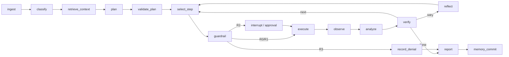

# SecMind A 组架构

## 运行链路

Orchestrator 是唯一持有全局状态和路由权的组件。专业 Agent 是受控节点，不可绕过 Guardrail 或 Tool Broker。状态图使用 LangGraph 检查点支持进程内暂停恢复，同时每个节点都将完整 `AgentState` 快照写入数据库。进程重启后从数据库快照安全重放；首版启用的 Bandit 工具是只读且幂等的。

## 数据与审计

PostgreSQL/SQLite 的 `runs` 表保存最新状态，`ledger_events` 保存 append-only 事件。事件哈希覆盖事件 ID、任务 ID、序号、类型、时间、主体、脱敏载荷和前序哈希。数据库可导出 JSONL，回放端必须先校验哈希链。

Qdrant 在 Compose 中预留给 C 组知识库和经过 Verifier 门禁的情景记忆。当前代码审计基线不依赖外部知识，避免在证据不充分时引入检索结论。

## 模型策略

确定性路由、预算、权限、证据校验和失败收敛不交给模型。非演示模式下 Planner 使用千问兼容结构化输出；模型失败时降级到静态只读审计计划。任何模型输出都必须再次通过计划 Schema 和工具白名单验证。

## 当前边界

- 代码审计端到端闭环已实现。
- 日志分析、应急响应和渗透测试只保留场景识别与扩展接口。
- 当前工具进程在受限 API 容器内执行，不是单工具临时容器；接入网络或写操作工具前必须实现独立 Docker/Kubernetes Job 沙箱。
- LangGraph 原生检查点当前为进程内存；数据库状态快照承担进程重启恢复。接入非幂等工具前应迁移到 PostgreSQL Checkpointer，并加入工具幂等键。

